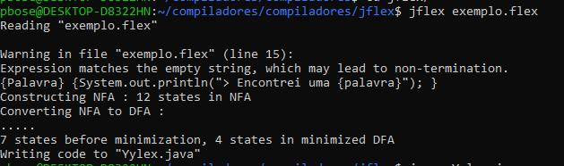
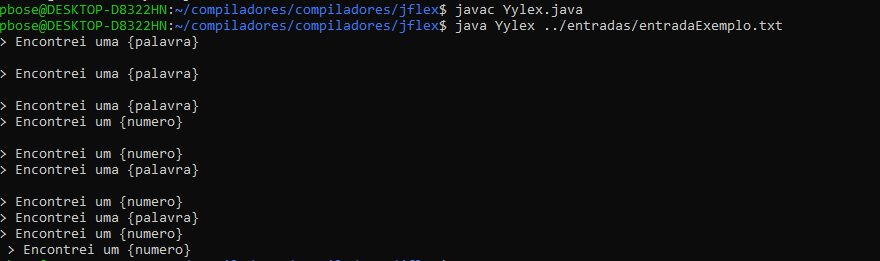

# COMPILADORES
Trabalho para disciplina compiladores 2025.2 - UFF  
Linguagem escolhida: Mini-Java  
https://www.cs.purdue.edu/homes/hosking/502/project/grammar.html  

# Esqueleto .flex
Primeira seção: importar códigos que será incluído  
%%  
Segunda seção: Definimos opções e declarações  
%standalone ->Essa opção indica que o programa gerado vai ser rodado apenas com analisador Léxico (sem o sintático)  

Letra = [a-zA-Z]  
Digito = [0-9]  
Palavra = {Letra}*  
Numero = {Digito}+  

%%  
Terceira seção: Regras e ações associadas   

# Como usar (usando jflex puro)
Primeiro criamos o arquivo .flex que será usado no jflex. Usamos o comando do jflex para realizar as etapas que vimos em sala, construir NFA, convertendo de NFA -> DFA e minimizando DFA.
  
Após isso será gerado um arquivo java. Compilamos o arquivo java e rodamos com um arquivo de entrada
  

# Como usar (usando pelo maven)
Primeiro executar: "mvn clean install" para que o plugin do jflex gere os arquivos java compilados  
Após isso, executar "mvn exec:java"  
Para configurar as entradas e a main altere no pom.xml na parte <configuration>